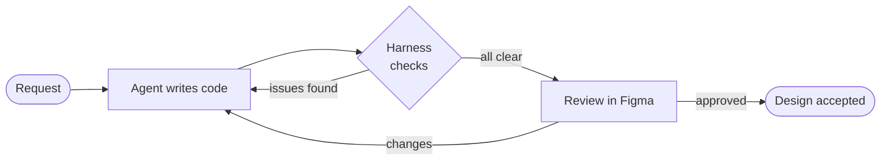
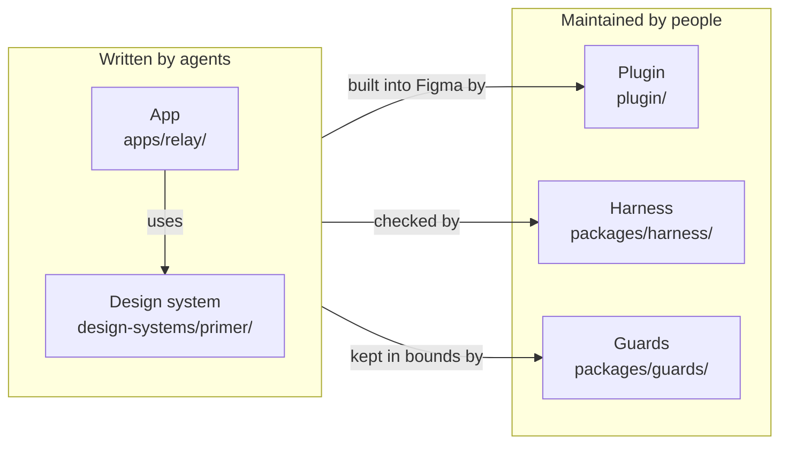

# Figma Harness

Let AI agents design in Figma, and prove the result is clean before a person looks at it.

Figma Harness is a workspace built for AI agents that create and change Figma designs. The agent never draws on the canvas: it writes TypeScript, a Figma plugin turns that code into real layers, and an offline harness checks every result for overflow, contrast, focus visibility, WCAG rules and broken prototype links. A person only steps in to review the finished design in Figma.

It is not a tool for designing by hand. The code-first design system, the harness, the checks and the guardrails all exist for one purpose: letting agents produce designs that stay consistent and accessible.

## Why agents need a harness

Agents are fast, but they cannot see the canvas. An agent asked to "add a settings page" directly in Figma will happily invent a colour instead of using a token, let a long name overflow its box, pick a grey that fails contrast, forget the focus state, or link a button to the wrong screen, and nobody notices until much later. Figma Harness gives the agent what a designer relies on:

- **A vocabulary.** The design system lives in code: colour and size tokens, text styles, icons and components. A page can only compose what the design system exports, and a missing component stops the task instead of being improvised.
- **Eyes.** A simulated Figma measures every layer with the real fonts and reports failures the agent can act on: which layer overflows and where, which text fails contrast and on which background, which prototype link is missing.
- **Limits.** Every task declares its kind, which fixes the files the agent may change, and a guard fails when it touches anything else.
- **A human gate.** A change that alters the design is held until a person has reviewed it in Figma and approved it.

## How an agent works here



1. **Pick a task.** `AGENTS.md` sends the agent to [`docs/ia/`](docs/ia/README.md), where it chooses a mode: build a page (the default), change the design system, explore an idea, or maintain the repository. Recording an approved design needs a person's explicit go-ahead.
2. **Write code, not layers.** A page composes the design system's components with deterministic sample data. It cannot reach into the design system's internals, hard-code a colour, or add a component.
3. **Check and fix.** `pnpm verify` runs everything offline, so the agent can loop until the report is clean.
4. **Hand over.** The agent reports what it changed and which frames to open. A person reviews them in Figma and approves the new fingerprint (the design signature) stored in `plugin/baselines/`. A change with no visual effect, such as a refactor, keeps the same fingerprint and needs no review.

## How code becomes a Figma file

`pnpm build` bundles the design system and the app into one plugin file, `plugin/code.js`. The same bundle runs in two places: in Figma Desktop, where the plugin builds the pages, and in the harness, where `pnpm verify` runs it against a simulated Figma.

In Figma, the plugin owns three pages: `01 · Screens` with the app's screens wired as a clickable prototype, `02 · Design system` with one documentation sheet per topic, and `03 · Design lab`, a scratch page for experiments. It can rebuild everything or refresh a single screen in place. Components are drawn as ordinary Figma layers with auto layout, not as Figma component instances.

## What the harness checks

| Area          | What fails                                                                                                                                                                                                                                                                                                                                  |
|---------------|---------------------------------------------------------------------------------------------------------------------------------------------------------------------------------------------------------------------------------------------------------------------------------------------------------------------------------------------|
| Layout        | Text or layers that overflow, get clipped or leave their frame, and fixed text boxes that would spill, with text measured in the real fonts. Every screen is also rebuilt at several window sizes and with extreme data such as long names and empty lists. Spacing and corner radii must stay on the design system's scale.                |
| Contrast      | Every rendered text against the surface actually behind it, with translucent layers composited ([WCAG 1.4.3](https://www.w3.org/WAI/WCAG22/Understanding/contrast-minimum.html)), then control edges and focus outlines ([1.4.11](https://www.w3.org/WAI/WCAG22/Understanding/non-text-contrast.html)). APCA scores are reported as advice. |
| Colour        | A state shown by colour alone ([1.4.1](https://www.w3.org/WAI/WCAG22/Understanding/use-of-color.html)), and categorical colours that become indistinguishable under simulated protanopia, deuteranopia or tritanopia.                                                                                                                       |
| Focus         | A control drawn in its focused state must show its outline where the design system places it, at 3:1 against everything the outline covers, and unclipped ([2.4.13](https://www.w3.org/WAI/WCAG22/Understanding/focus-appearance.html)).                                                                                                    |
| Surfaces      | A panel separated from its background only by a shadow.                                                                                                                                                                                                                                                                                     |
| Prototype     | Missing or misdirected links, unreachable screens, animated page navigation, and animations that do not use the design system's timing and easing.                                                                                                                                                                                          |
| Design system | A colour token painted where its role does not allow it (a border colour used as text, for example), colours or components missing from the documentation sheets, and generated tokens or icons that no longer match their source packages.                                                                                                 |
| Repository    | Code importing what its layer may not, and, with `pnpm guard:scope`, files changed outside the task's allowed set.                                                                                                                                                                                                                          |
| Review        | Any difference from the last approved fingerprint.                                                                                                                                                                                                                                                                                          |

Components also follow the W3C [Authoring Practices Guide (APG) patterns](https://www.w3.org/WAI/aria/apg/patterns/) and record their roles, states and labels on each layer for the developers who build the real product: dialogs are modal, take focus and close on Escape; alerts and status messages are live regions; fields carry their label, description, required and invalid states; switches, checkboxes and radios expose their state; the current page is marked. These annotations are recorded but not yet audited.

When a design system knowingly departs from a rule, the exception is written down with its reason and printed in every report. Nothing is silently waived.

## The example in this repository

A complete example ships with the repository so the whole loop works out of the box. Both parts can be replaced:

- **Design system: [Primer](https://primer.style)**, GitHub's open-source design system, in its light theme (`design-systems/primer/`). Its colours, sizes, type, shadows, motion and icons are generated from Primer's npm packages, 33 of its components are redrawn, and everything is documented on 21 sheets.
- **App: Relay**, a made-up release-management tool (`apps/relay/`). Seven screens (an overview, the list of releases, one release, the same release with its confirmation dialog open, and a settings form at rest, with an unsaved change and after a failed save) are linked into a clickable prototype.

To plug in your own design system, see [Design systems](docs/design-systems.md). To add screens, see the [page workflow](docs/ia/PAGE_WORKFLOW.md).

## Get started

You need Node.js 22.12 or newer, pnpm (`corepack enable` installs the pinned version) and Figma Desktop.

```bash
pnpm install
pnpm build    # bundle the plugin into plugin/code.js
pnpm verify   # run every check, offline
```

Then point your agent at the repository. Claude Code loads `AGENTS.md` through `CLAUDE.md`, and agents that follow the `AGENTS.md` convention read it directly. Requests such as "add a page that lists Relay's environments" (a page task) or "add a tabs component to the design system" (a design-system task) go through the loop above.

To see the result, in Figma Desktop:

1. Open a new file you can throw away: the plugin replaces the content of the three pages it uses, which also fit a free Starter file.
2. Choose **Plugins → Development → Import plugin from manifest** and select `plugin/manifest.json`.
3. Run **Figma Harness** and choose **Rebuild everything**.
4. Present `01 · Overview` to click through the prototype.

The plugin has no network access.

## Repository layout



| Folder                   | What it is                                                                           | Who changes it                 |
|--------------------------|--------------------------------------------------------------------------------------|--------------------------------|
| `apps/relay/`            | The example app: screens, prototype links, sample data                               | Agents, in page tasks          |
| `design-systems/primer/` | The example design system: tokens, icons, components, documentation sheets           | Agents, in design-system tasks |
| `plugin/`                | The Figma plugin. `src/composition.ts` picks the design system and the app it builds | Maintainers                    |
| `packages/harness/`      | The checks: simulated Figma, audits, renders, fingerprints                           | Maintainers                    |
| `packages/guards/`       | Repository rules: which code may import which, and which files a task may change     | Maintainers                    |
| `packages/engine/`       | Shared code that creates Figma layers, variables and prototype links                 | Maintainers                    |
| `packages/contract/`     | The TypeScript interfaces that connect everything above                              | Maintainers                    |
| `docs/`                  | Instructions for agents, acceptance rules and design decisions                       | Maintainers                    |

## Documentation

| Topic                                               | Document                                                             |
|-----------------------------------------------------|----------------------------------------------------------------------|
| Task modes, allowed files and workflows for agents  | [`docs/ia/README.md`](docs/ia/README.md)                             |
| What must pass, and how a design change is approved | [`docs/ia/ACCEPTANCE_GATES.md`](docs/ia/ACCEPTANCE_GATES.md)         |
| Using your own design system                        | [`docs/design-systems.md`](docs/design-systems.md)                   |
| The Primer example: updating it, adding components  | [`design-systems/primer/README.md`](design-systems/primer/README.md) |
| Every command and every check                       | [`packages/harness/README.md`](packages/harness/README.md)           |
| The plugin and the pages it builds                  | [`plugin/README.md`](plugin/README.md)                               |
| Design decisions                                    | [`docs/adr/README.md`](docs/adr/README.md)                           |
| Contributing                                        | [`CONTRIBUTING.md`](CONTRIBUTING.md)                                 |

## License

[MIT](LICENSE). The Primer example copies material from GitHub's Primer Primitives and Octicons under their own MIT licences, listed in [its notice](design-systems/primer/NOTICE.md). Relay is fictional, and this project is not affiliated with or endorsed by GitHub.
