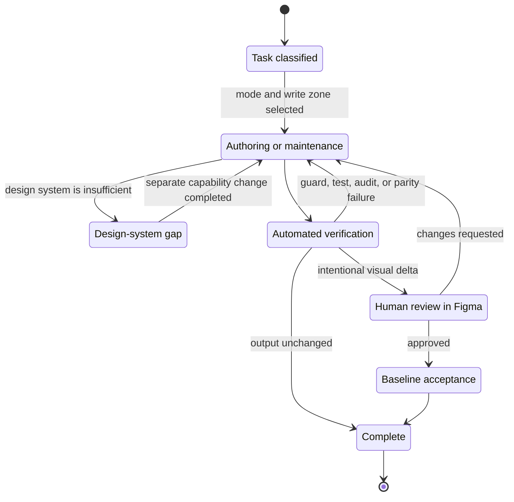

# AI authoring router

This directory is the operating manual for an agent that creates or maintains designs in this workspace. `AGENTS.md` is the implicit entry point; this file routes the task to the smallest relevant instruction set. The source tree remains ordinary product code: there is deliberately no `ai/` source layer.

## Choose one mode before editing

| Mode | Use it for | Read next |
| --- | --- | --- |
| `PAGE_AUTHORING` (default) | A new page, screen, state, or prototype flow assembled from the current design system | `AUTHORING_CONTRACT.md`, `PAGE_WORKFLOW.md`, `ACCEPTANCE_GATES.md` |
| `DESIGN_SYSTEM_CHANGE` | A new or revised token, primitive, component, or reusable pattern, or a new design system | `AUTHORING_CONTRACT.md`, `ARCHITECTURE_BOUNDARIES.md`, `DESIGN_SYSTEM_WORKFLOW.md`, `ACCEPTANCE_GATES.md` |
| `DESIGN_EXPLORATION` | A disposable visual direction in the Design lab | `AUTHORING_CONTRACT.md`, `ARCHITECTURE_BOUNDARIES.md`, `ACCEPTANCE_GATES.md` |
| `STRUCTURAL_MAINTENANCE` | Refactoring folders, imports, build mechanics, documentation, or verification infrastructure without changing the document, or creating an app | `AUTHORING_CONTRACT.md`, `ARCHITECTURE_BOUNDARIES.md`, `ACCEPTANCE_GATES.md` |
| `BASELINE_ACCEPTANCE` | Recording a visual signature already reviewed and explicitly approved by a human | `AUTHORING_CONTRACT.md`, `ACCEPTANCE_GATES.md` |

When the request is ambiguous, use `PAGE_AUTHORING`. Changing mode requires an explicit task-level reason; discovering that a component is missing is not permission to edit the design system.

## Authoring and acceptance states

## Sources of truth

- `authoring-policy.json` is the write-scope policy the guards read.
- Each workspace package's `package.json` declares its role (`figmaHarness.role`); the guards derive the dependency rules from it.
- The package entry of the design system an app depends on (for Relay, `@figma-harness/primer`) is the only supported visual API for that app.
- An app's `src/fixtures/index.ts` is its only supported scenario API, and its `src/screens.ts` registers every generated screen.
- `figma-harness.config.json` names the active app, the one the plugin builds; its single design-system dependency decides the design system. `pnpm use <app>` switches it. `plugin/src/composition.ts` imports both through build aliases, and `plugin/src/document/builders.ts` lays out the three owned pages.
- The design system's `src/foundations/audit.ts` and the plugin's `src/document/contract.ts` declare what the offline audits measure, typed by `@figma-harness/contract`.
- `docs/adr/` records repository decisions; a design system records its own under its `docs/adr/`.
- An app's `baselines/*.json` records its reviewed generated output, never intent.
- `templates/` holds the design system template and the app template that `pnpm create:design-system` and `pnpm create:app` copy. Templates change only in `STRUCTURAL_MAINTENANCE`.

Checks run on the active app. `FIGMA_HARNESS_APP=apps/<app>` selects another app for one command, and `pnpm each <check>` runs a check on every app.

Run `pnpm guard` from the repository root to validate the static contract. Use `pnpm guard:scope --mode=<MODE> --base=<git-ref>` to validate a task's changed-file scope. Before a release, complete the native-editor gate in [`ACCEPTANCE_GATES.md`](./ACCEPTANCE_GATES.md#native-figma-desktop-gate).
