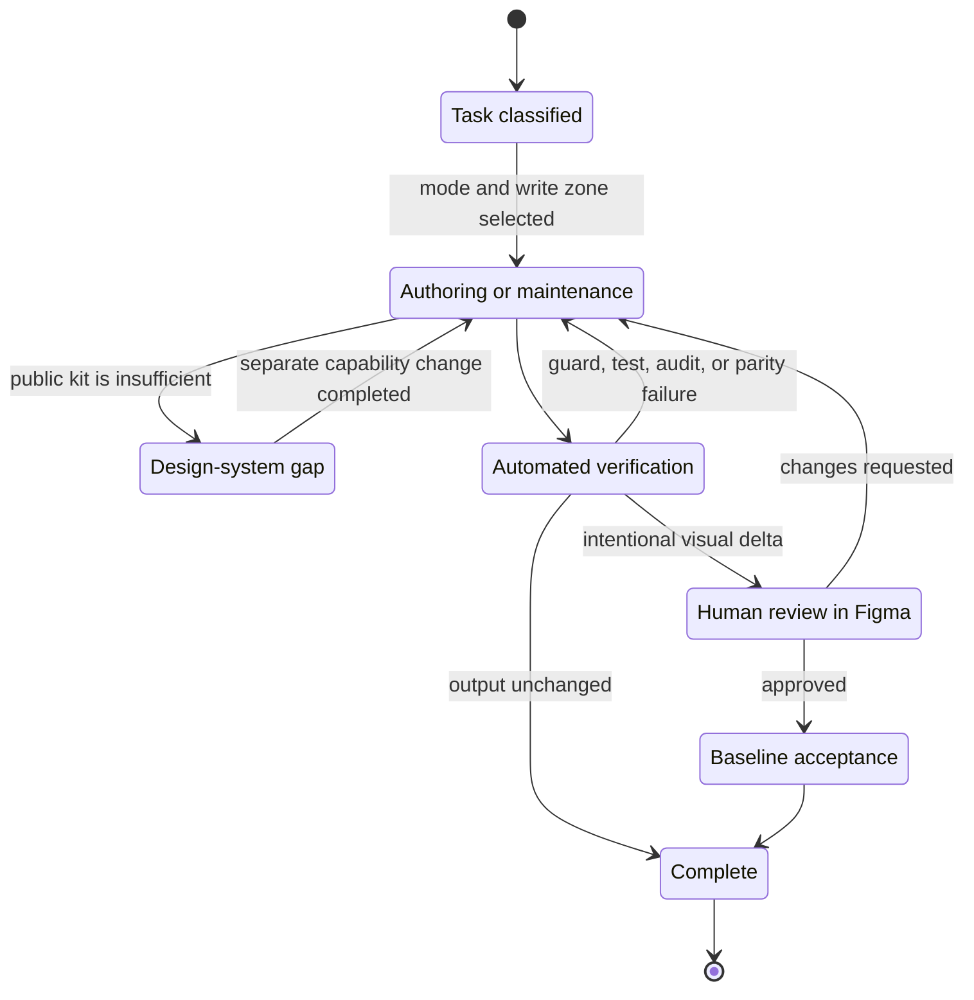

# AI authoring router

This directory is the operating manual for an agent that creates or maintains designs in this workspace. `AGENTS.md` is the implicit entry point; this file routes the task to the smallest relevant instruction set. The source tree remains ordinary product code: there is deliberately no `ai/` source layer.

## Choose one mode before editing

| Mode | Use it for | Read next |
| --- | --- | --- |
| `PAGE_AUTHORING` (default) | A new page, screen, state, or prototype flow assembled from the current kit | `AUTHORING_CONTRACT.md`, `PAGE_WORKFLOW.md`, `ACCEPTANCE_GATES.md` |
| `DESIGN_SYSTEM_CHANGE` | A new or revised token, primitive, component, or reusable pattern | `AUTHORING_CONTRACT.md`, `ARCHITECTURE_BOUNDARIES.md`, `DESIGN_SYSTEM_WORKFLOW.md`, `ACCEPTANCE_GATES.md` |
| `DESIGN_EXPLORATION` | A disposable visual direction in the design lab | `AUTHORING_CONTRACT.md`, `ARCHITECTURE_BOUNDARIES.md`, `ACCEPTANCE_GATES.md` |
| `STRUCTURAL_MAINTENANCE` | Refactoring folders, imports, build mechanics, documentation, or verification infrastructure without changing the document | `AUTHORING_CONTRACT.md`, `ARCHITECTURE_BOUNDARIES.md`, `ACCEPTANCE_GATES.md` |
| `BASELINE_ACCEPTANCE` | Recording a visual signature already reviewed and explicitly approved by a human | `AUTHORING_CONTRACT.md`, `ACCEPTANCE_GATES.md` |

When the request is ambiguous, use `PAGE_AUTHORING`. Changing mode requires an explicit task-level reason; discovering that a component is missing is not permission to edit the kit.

## Authoring and acceptance states

## Sources of truth

- `authoring-policy.json` is the write-scope policy the guards read.
- `plugin/src/kit/public.ts` is the only supported visual API for designs.
- `plugin/src/fixtures/public.ts` is the only supported scenario API for designs.
- `plugin/src/designs/pages/state-matrix.ts` registers every generated screen; `plugin/src/designs/catalog.ts` lays out the three owned pages.
- `plugin/src/designs/harness-contract.ts` and `plugin/src/kit/foundations/audit.ts` declare what the offline audits measure.
- `docs/adr/` records accepted cross-cutting design and interaction decisions.
- `plugin/tools/runtime/*baseline.json` records reviewed generated output, never intent.

Run `npm run guard` from `plugin/` to validate the static contract. Use `npm run guard:scope -- --mode=<MODE> --base=<git-ref>` to validate a task's changed-file scope. Before a release, complete the native-editor gate in [`ACCEPTANCE_GATES.md`](./ACCEPTANCE_GATES.md#native-figma-desktop-gate).
